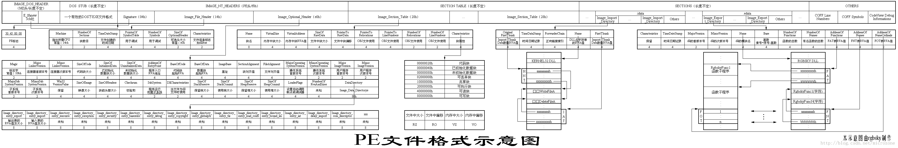
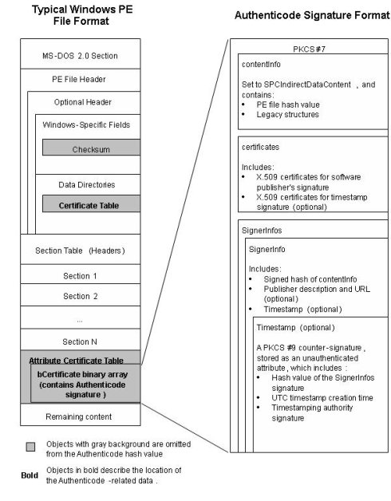

# EFI file format

EFI 采用 PE 格式，更多关于PE文件格式可前往微软官方网站查阅。

在PE文件中的可信代码数字签名是一个PKCS #7 签名块结构。该签名可以保证：
- 这份软件源于某个确定的软件发布者。
- 这份软件自从签署以来没有经过修改。

一份PKCS #7 签名块结构包含该PE文件的哈希值、通过软件发布者私匙创建的签名以及将软件发布者的签名密匙绑定到一个合法实体的X.509 v3证书。一份PKCS #7签名块可以包含以下可选信息：

- 关于软件发布者的描述
- 软件发布者的链接
- 可信代码签名的时间戳

签名时间戳由时间戳权威机构(TSA)生成，并且保证软件发布者所做的签名在这个时间戳之前已经存在。这个时间戳可以延长了这个签名的生命期，即便相关的签名证书已经过期或者后来被废除。

可信代码签名可以被嵌入到Windows的PE文件中，位于PE文件的Optional Header Data Directories结构中Certificate Table所指向的位置。当可信代码签名被用于签署一个Windows PE文件时，计算文件数字签名哈希值的算法略过PE文件结构中的特定字段。当把数字签名嵌入文件时，签名过程可以修改这些字段，而不致于影响文件的哈希值。

配合图
 签名数据位置  
 签名数据格式  
可能更容易懂一点

>数字签名格式 Authenticode。
>Authenticode®是一种数字签名格式，它是用来验证二进制软件的来源和完整性。
>Authenticode是基于公开密匙加密标准(PKCS) #7 来签名数据，并使用X.509证书来绑定经过数字签发的二进制程序与其软件发布者的身份的联系。这份文档包含Authenticode签名的结构和技术细节。

## “PE文件格式”1.9版
[更多PE文件格式细节](PE-file-format)

